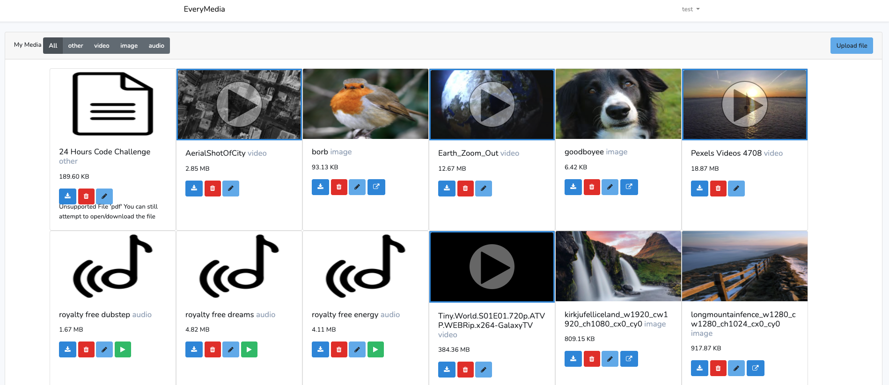

# Laravel: store and view media




# setup
- you will need to add aws keys for S3 access in the .env file.
- set all DB database/user/pass to everymedia. This can be changed in the docker-compose files

# How it works

When you upload a file it gets stored temporarily on the server, then processed and uploaded to s3.

the media is put on a background queue to:
- upload the original file to S3
- get a thumbnail from a video using FFMPEG
- resize thumbnails and upload to S3

You can view the status of the jobs at http://localhost:8000/horizon/dashboard

After you upload the file, for a few seconds you will see "File is being processed" on
the main screen, after a few seconds it will process and you can use the file.


  - uploaded videos get the frame extracted at second 1 and that is used as a thumbnail 
  - all thumbnail images for videos/audio are resized so the page loads faster
  - files are saved based on their sha1 hash, so uploading the same file with a different name does not cause a duplicate (currently no error displayed when duplicate uploaded)


# To run

`docker-compose up` then wait.. it has to do a composer install and DB setup on first run

leave it for a bit and once composer container completes, exit and start back up again
 as the migrations container needs composer to be done. [@todo] make this flow more cleaner


# Developing

- `npm install`
- changing css ? `npm run dev`


# Credits / tools used
    - docker
    - php8
    - mysql8
    - redis
    - laravel for the backend framework
    - laravel horizon for the queue management
    - ffmpeg for getting video thumbnails
    - bootstrap
    - bugsnag for error moritoring
    - flysystem and aws-sdk for managing files on S3


    
```
    https://github.com/PHP-FFMpeg/PHP-FFMpeg
    - generating thumbnails from video files using ffmpeg
```

```
    https://sweetalert2.github.io/
   -  popups and toasts
```

# To do if there was more time
```
    - Spend more time planning and focusing on the code structure instead of making a MVP
    - Ability to tag or create custom categories. currently it automatically creates categories based on mime type, but we would want to go further e.g music genre
    - More media types e.g pdf, csv, txt -  all common types
    -- Better handling of media types. classes e.t.c dedicated to types of files and previews. e.g pdf preview thumbnail from first page
    -- Currently content types audio/video are check in controllers and views. there is probably a cleaner way to do this and have each 'Box' in the view rendered based on a component for each content type
    - Show artwork for mp3 files from ID3
    - Better authentication - email verification, 2FA. currently its a simple login/register
    - User account removal - allow user to delete account and wipe all files including thumbnails
    - Websockets to notify when file is processesed and auto update the page. also could be used if logged in on 2 devices, new media will auto appear when uploaded on another device
    - Share media with other registered users, or add public links to files
    - Store (redis) where you were when listening/watching media, and resume from that last position
    - Add the ability to play media over chromecast (javascript/html)
    - Use more of FFMPEG abilities, e.g auto convert videos to common format
    - Upload multiple files at once, using chunks for large files.
    - No reload after upload, elements should be added based on data send over sockets once the media is processed by jobs
    - tests, integragration, unit, code style checkers e.t.c
    - CICD..pipelines .e.t.c dev and prod env
    -- Currently deployments are just a simple git push to ec2, and that triggers some docker commands via git hooks
    - Media delivered over cloudfront instead of direct from S3. currently bucket is eu-west-1 
    - Thumbnails could be stored locally, but having it all on S3 makes it easier to share the project
    - Would have preferred to do it in vue js but was more familiar with bootstrap+jquery so reverted to that to get it done faster
    - Dark theme, detect current system theme
    - Better button layout for files, there are too many buttons for download, delete, edit. better to have a right click menu instead of all the different buttons for e
    - Use cron jobs to "watch" a folder and auto import media
    - Lazy load the page if there is a lot of content
    - More meta data options e.g image exif data
    - Different layout options. currently it shows icons and file name. The ability to show files in a list would be good 
    - search for files (sphinx/elasticsearch or basic datatables in browser)
    - show most recent / most acccessed media at the top, push unused media to the bottom. accessed_at timestamp in the DB
    - autoplay next music track
```
